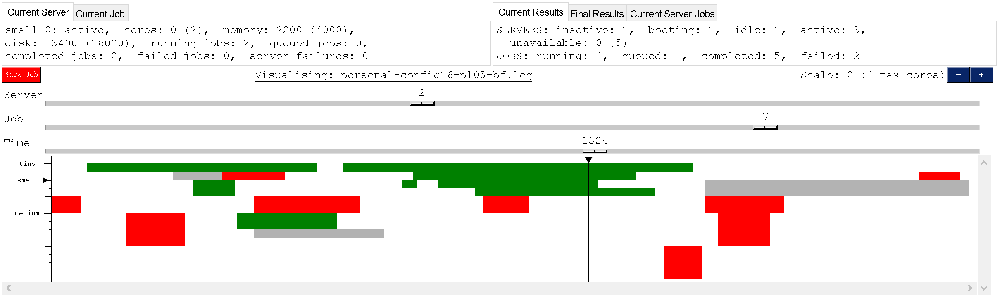
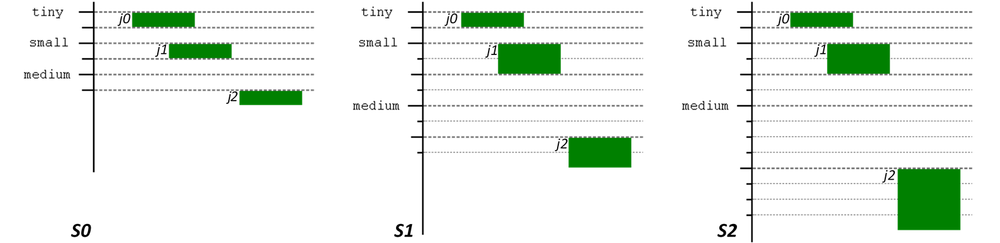
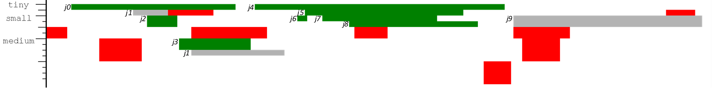
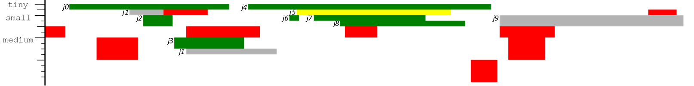

Job scheduling is a fundamental aspect of cloud computing. ds-sim offers a platform for testing job scheduling
algorithms in various server configurations. However, ds-sim’s logs can be overwhelmingly verbose, greatly hindering a
researcher’s ability to evaluate the performance of scheduling algorithms. sim-viz addresses this shortcoming by
summarizing and presenting simulation logs in an accessible format.

In order to visualise a simulation, sim-viz requires at least two files: the configuration file used in a simulation and
the log file of the simulation’s output. The config file provides the information necessary to display servers while job
details are provided by the log. In addition, a failure resources file can be provided to add failure information to the
visualisation. It could be possible to create a visualisation by only using a log, but doing so may result in inaccurate
visualisations. By taking advantage of config and failure files, it is assured that simulations are accurately depicted.

The visualisation itself is comprised of two sections: the “Status” includes a detailed textual display, while the
“Timeline” is a graphical representation of the simulation. The Status section contains two sub-sections, these
sub-sections are placed next to one another, above the Timeline.

The first Status sub-section reports information on the currently selected server or job at any point of time in the
simulation.

The “Current Server” tab describes the selected server’s type, ID, available and total cores, available and total
memory, as well as available and total disk space. This tab also shows the current number of running and queued jobs on
the selected server, the number of jobs that have completed or failed on the server up until the current time, as well
as how many times that the server itself has failed.

<pre>
<b>Current Server</b>
<i>server_type server_id: server_state,</i> <b>cores:</b> <i>available_cores </i>(<i>total_cores</i>), <b>memory:</b> <i>available_memory</i> (<i>total_memory</i>),
<b>disk</b>: <i>available_disk</i> (<i>total_disk</i>), <b>running jobs:</b> <i>running_job_count</i>, <b>queued jobs:</b> <i>queued_job_count</i>
<b>completed jobs:</b> <i>completed_job_count</i>, <b>failed jobs:</b> <i>failed_job_count</i>, <b>server failures:</b> <i>fail_count</i>
</pre>

The “Current Job” tab outlines the selected job’s ID, state, and memory and disk space requirements. This tab then
describes the exact time that the job is scheduled, when it starts executing, and when the job completes or fails.
Whether the current allocation for the selected job will result in completion or failure is also specified.
Additionally, this tab shows the number of times the selected job has failed up to the current time, as well as the
server that it is currently assigned to.

<pre>
<b>Current Job</b>
<b>j </b><i>job_id: job_state,</i> <b>cores:</b> <i>required_cores</i>, <b>memory:</b> <i>required_memory, </i><b>disk</b>: <i>required_disk,</i>
<b>schd:</b> <i>schedule_time</i>, <b>start:</b> <i>start_time</i>, <b>end: </b><i>end_time</i>, <b>will fail:</b> <i>will_fail, </i><b>fails:</b> <i>fail_count</i>
<b>On server:</b> <i>assigned_server_type assigned_server_id</i>
</pre>

The second Status sub-section outlines the collective status of all servers and jobs.

The “Current Results” shows the cumulative records of all servers and jobs up until the selected time. This tab lists
the number of servers currently in each state (inactive, booting, idle, active, unavailable), as well as the total
number of server failures up until the selected time. Additionally, it describes the number of jobs that are currently
running or waiting in a queue, as well as how many jobs have already completed in addition to the total job failure
count at the selected point in time.

<pre>
<b>Current Results</b>
<b>SERVERS:</b> <b>inactive: </b><i>inactive_total</i><b>, booting: </b><i>booting_count</i><b>, idle: </b><i>idle_count</i><b>, active: </b><i>active_count</i><b>,</b>
<b>  unavailable: </b><i>unavailable_count</i> (<i>unavailable_total</i>)
<b>JOBS: running: </b><i>running_count</i><b>, queued: </b><i>queued_count</i><b>, completed: </b><i>completed_count</i><b>, failed: </b><i>failed_count</i>
</pre>

The “Final Results” tab simply describes the results and statistics from the end of the simulation. This tab lists the
simulation end time, the number of servers used, average server utilisation, and total cost. In addition, it also states
job scheduling figures, such as average waiting time, average execution time, and average turnaround time.

<pre>
<b>Final Results</b>
for <i>group</i> in <i>server_groups</i> {
  <i>group_use_count group_name </i><b>servers used with a utilisation of</b> <i>group_utilisation</i> <b>at the cost of</b> <i>group_cost</i>
}
<b>=============================== [ Overall ] ===============================</b>
<b>actual simulation end time: </b><i>end_time</i>
<b>total #servers used: </b><i>total_servers</i><b>, avg utilisation: </b><i>average_server_utilisation</i><b> and total cost: </b><i>total_server_cost</i>
<b>avg waiting time: </b><i>avg_job_wait</i><b>, avg exec time: </b><i>avg_job_exec</i><b> and avg turnaround time: </b><i>avg_job_turnaround</i>
</pre>

The Timeline is a 2D graphical representation of the simulation, the x-axis is time, the y-axis are servers. Servers are
grouped by type, server cores are depicted as rows, each core is stacked vertically on one another. The row (core)
height and scaling are set by the user, the number of visible cores is limited to a maximum of two to the power of the
scaling value. For example, if the scaling value was set to one (S1) then two cores at most will be visible per server,
a four-core server will be collapsed down to two. The below example demonstrates the scaling values of S0, S1, and S2
with three server groups, each containing two servers. Tiny servers have one core each, small servers have two cores,
and medium servers have four cores. Three jobs are scheduled in this example, j0 requires one core, j1 requires two
cores, and j2 requires four cores. Scaling allows for both a broad overview to identify patterns, and a more detailed
view for precise inspections.

Each server failure is depicted as a red rectangle that spans all cores of that server, from the point of failure until
recovery.

Jobs are depicted as coloured bars within the server core rows, beginning at the start of execution and ending at the
point of job completion or failure. Each job spans as many rows as the job requires for execution in order to represent
server core usage and concurrency. For example, if a four-core server is running two jobs, where the first job requires
two cores and the second requires one core, then the first job will take the first two core rows while the second job
takes the third core row, leaving the fourth core empty.

The colour of a job indicates how many times it has failed. A job that completes without failing is coloured green. If a
job fails, its first attempt will be coloured light grey. Each subsequent failure will create darker colours until black
is reached, clearly distinguishing zero-failure, low-failure, and high-failure jobs from one another.

Additionally, the currently selected job can be highlighted, colouring it yellow. This allows for quick identification
of a particular job within the visualisation.

Below is the graphical visualisation of a simple 2243-second simulation using a best-fit scheduling algorithm. This
simulation has ten jobs and three server groups, each of which are composed of two servers. Maximum scaling is applied,
so all cores are fully visible. As can be observed, tiny servers have one core, small servers have two cores, and medium
servers have four cores. The majority of jobs have completed without failure, shown by the 8 green bars. The second job
(j1) was still running on tiny 1 when the server failed, as indicated by the grey job bar ending with a red failure bar.
This job then had to be rescheduled to medium 0 for it to complete. Medium 0 was already running a two-core job, but it
could take on j1 as it only needed one-core and medium 0 had two spare cores. The last job on small 0 was previously
scheduled on other servers which had failed while it was still waiting in their job queue. This queue information is
available in the Status section.

This is also a good demonstration as to how highlighting can be helpful in discerning jobs from one another. This can be
observed with j5, which may otherwise blend in with the surrounding jobs.

